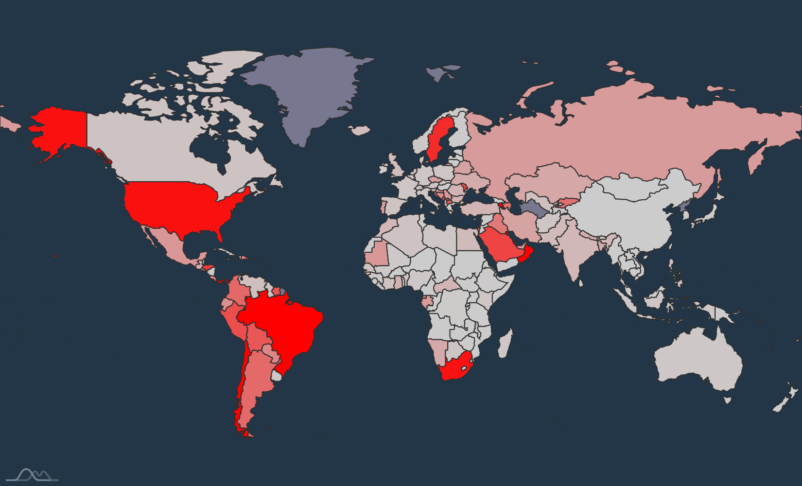
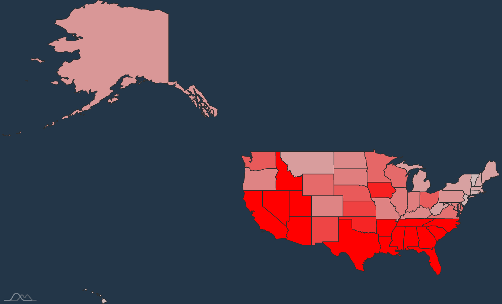
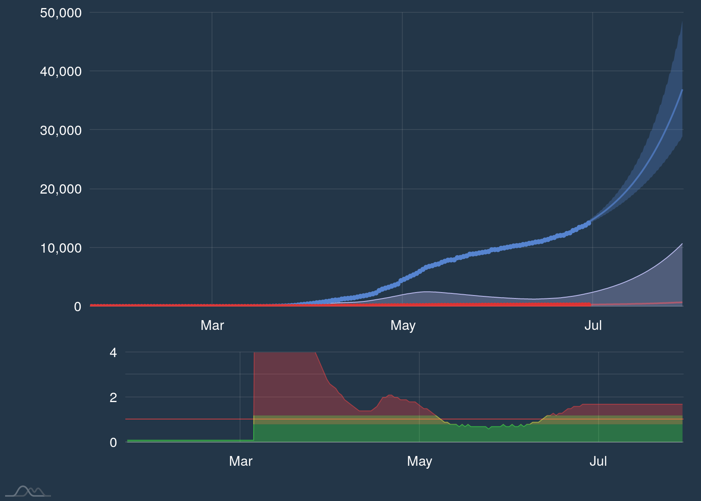

# Graphs to track the spread of COVID-19 worldwide

[A website with graphs](https://webtrino.eu/covid-19/) displaying the spread of COVID-19 worldwide.

### Example graphs






## Updating data files
Use [this seird model](https://github.com/tbuytaer/seird) to generate the JSON files and place them in `/public/data/` and `/dist/data/`.

Or just place them in `/public/data/` and compile this project, which will also place the data files in `/dist/data/`.

## Project setup
```
npm install
```

### Compiles and hot-reloads for development
```
npm run serve
```

### Compiles and minifies for production
```
npm run build
```

### Lints and fixes files
```
npm run lint
```

### Customize configuration
See [Configuration Reference](https://cli.vuejs.org/config/).
